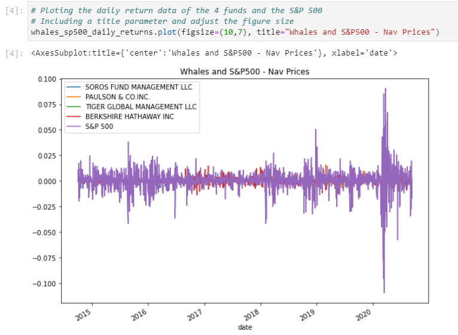
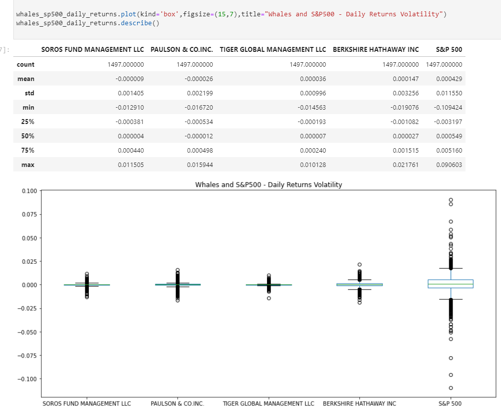

# Analyzing Portfolio Risk-Profit

This is a Python application that utilizes native Python libraries such as Pandas, Numpy, matplotlib and it uses JupyterLab is a web-based user interface that you use to run and review the syntax code what is refer to as Notebook.  This notebook allows the user to produce quantitative analizes on selected portfolios using the SP500 as base of comparison.  The notebook helps illustrate and compare investment key risk-management metrics such: the daily returns, standard deviations, Sharpe ratios, and betas.  The application works by taking NAV price history from a '.csv' file 'whales.csv' and the user plots.

---


## Technologies

This project leverages python 3.7 with the following packages:

* [Pandas](https://pandas.pydata.org/docs/user_guide/visualization.html) - For the command line interface, help page, and entrypoint.

* [JupyterLab](http://jupyterlab.io/) - For interactive user workspace that utilizes Notebook.

* [Numpy](https://numpy.org/doc/stable/reference/generated/numpy.sqrt.html) - NumPy sqrt function. Return the non-negative square-root of an array, element-wise. The values whose square-roots are required.

* [matplotlib](https://matplotlib.org/) - a cross-platform, data visualization and graphical plotting library for Python and its numerical extension NumPy. 

---

## Installation Guide

Before running the application first install the following dependencies.


* [Git Bash (Windows) or Terminal (macOS)] (https://git-scm.com/downloads) -  
* [Anaconda with Python 3.7] (https://docs.anaconda.com/anaconda/install/) - 


---

## Examples

This section includes screenshots of few plots that can easyly be obtain by running this notebook.

- Illustrating the daily return data of the four fund portfolios and the S&P 500

- Illustrating the daily returns volatility in portfolios and the S&P 500

---

## Usage

To use AnalyzingPortfolioRisk-Profit book simply clone the repository and run "Git Bash" with:

```
- Start by activating an Anaconda Environment instance.
- Then follow by starting Jupyter Lab

```
Upon launching the loan qualifier application you will be greeted with the following prompts.


---

## Contributors

Brought to you by Carlos R. you may reach me at reachcarlostoday@gmail.com

---

## License

MIT.
